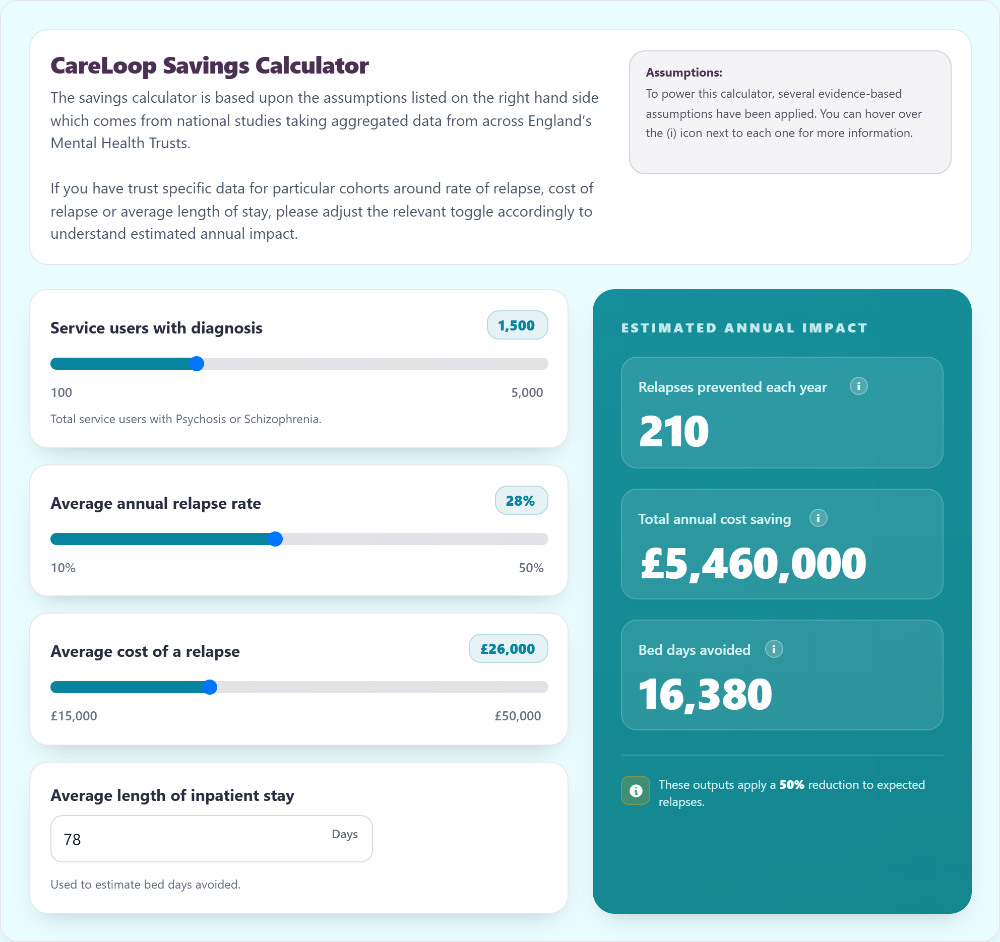

# CareLoop Savings Calculator

A single-page estimator that lets NHS mental health trust finance and commissioning staff model the potential annual savings — relapses prevented, cost saved, and inpatient bed days avoided — from reducing psychosis/schizophrenia relapse rates, using UK-specific pricing assumptions.



## Live demo

**[hazzjc.github.io/PsychosisImpactPriceCalculator](https://hazzjc.github.io/PsychosisImpactPriceCalculator/)**

## What it calculates

The calculator takes four inputs, all editable via sliders/number input:

| Input | Default | Range |
|---|---|---|
| Service users with a Psychosis/Schizophrenia diagnosis | 800 | 100 – 5,000 |
| Average annual relapse rate | 20% | 10% – 50% |
| Average cost of a relapse | £25,000 | £15,000 – £50,000 |
| Average length of inpatient stay (days) | 82 | 1 – 365 |

From these it derives three outputs, applying a **fixed 50% relapse-reduction assumption** (not user-adjustable) on top of the entered relapse rate:

- **Relapses prevented each year** = `service users × relapse rate × 0.5`
- **Total annual cost saving** = `relapses prevented × average cost of a relapse`
- **Bed days avoided** = `relapses prevented × average length of inpatient stay`

## Constraints and product decisions (baked-in assumptions)

These are hard-coded in `index.html` and are not sourced or cited in-file beyond the on-page tooltip text:

- **50% relapse reduction** is applied unconditionally to every scenario. The in-app tooltip attributes this to "the Empower 2022 study published in The Lancet Psychiatry," describing a 50% reduction in relapse events for patients supported by "CareLoop's remote monitoring platform" alongside standard care, versus standard care alone. This is a fixed multiplier in the code (`* 0.50`), not something a user can turn off or vary — so every output figure assumes the CareLoop intervention is fully effective at that rate for the modelled population.
- **£25,000 default cost per relapse** — described in the tooltip as "conservatively estimated," adjustable by the user between £15,000 and £50,000, but with no in-file citation for the figure or its range.
- **82-day default average length of inpatient stay** — used purely to translate relapses prevented into bed days avoided; no citation given in this file for the figure.
- The calculator assumes a linear, deterministic relationship between all inputs and outputs — there is no confidence interval, sensitivity range, or uncertainty modelling in the outputs shown.

## Architecture

This is a single static HTML file (`index.html`, ~19KB) with no build step and no backend:

- Styling via Tailwind CSS (loaded from the `cdn.tailwindcss.com` play CDN) plus a small block of custom CSS for the range-slider theme, card shadows, and info tooltips.
- Font: Google Fonts (Inter).
- All calculation logic is inline vanilla JavaScript in a single `<script>` block — four `input`/`range` elements update three output values on every `input` event, with no external dependencies, state persistence, or API calls.
- The page also contains a dynamic-scaling script that shrinks the whole layout to fit the viewport (intended for embedding, e.g. in an iframe).
- Hosted directly via GitHub Pages from this repository's default branch — there is no `docs/` build output other than the screenshot added for this README.

## Quality evidence

There are no automated tests, no CI configuration, and no linting set up in this repository. The only verification performed for this README was manual: exercising the live deployed page in a browser with sample inputs (1,500 users, 28% relapse rate, £26,000 cost per relapse, 78-day length of stay) and confirming the output figures matched the formulas above (210 relapses prevented, £5,460,000 saved, 16,380 bed days avoided).

## Setup

No installation or build step is required.

```bash
git clone https://github.com/HazzJC/PsychosisImpactPriceCalculator.git
cd PsychosisImpactPriceCalculator
```

Then either:
- Open `index.html` directly in a browser, or
- Serve it locally, e.g. `python -m http.server` and visit `http://localhost:8000`.

To deploy your own copy, enable GitHub Pages on the repository (Settings → Pages → deploy from the default branch).

## Limitations and status

- **Prototype-stage, single-file tool** — there's no input validation beyond the slider/number bounds, no error states, and no accessibility testing beyond what Tailwind and native `<input>` elements provide by default.
- **The 50% relapse-reduction figure is fixed**, not sourced to a specific, verifiable citation within this file (only described via an on-hover tooltip), and cannot be adjusted by the user even though the surrounding copy invites users to "adjust the relevant toggle" for trust-specific data — that toggle does not exist for the reduction rate itself.
- **No sourcing given in this file** for the default £25,000 relapse cost or 82-day length of stay, beyond describing the cost figure as "conservative."
- **"CareLoop" branding overlap**: this page is titled "CareLoop Savings Calculator" and uses the same "CareLoop" product name, remote-monitoring-platform framing, and Lancet Psychiatry EMPOWER-trial citation as the calculator in [HazzJC/DigitalTheraputicCostSavings](https://github.com/HazzJC/DigitalTheraputicCostSavings) (there titled "CareLoop ROI Calculator"). That sibling repository is a more developed iteration of essentially the same model — it names the same 50% relapse-reduction effect, cites the same EMPOWER trial (Gumley et al., *The Lancet Psychiatry* 2022) explicitly with a DOI, and additionally cites Munro et al. (*The Psychiatrist*, 2011) for its £25,852 average relapse cost figure and NHS England Hospital Admitted Patient Care Activity data (2024/25) for its 78-day average length-of-stay figure. Neither repository documents the relationship between the two explicitly (no README cross-reference, no shared package, no comment in the code). Based on the shared branding, shared citations, and near-identical formulas, this repository appears to be an earlier or simplified standalone version of the same "CareLoop" savings/ROI concept, but that is an inference from the code, not a documented fact.
- No licence file is present in this repository (see below).

## Attribution and data provenance

- The **50% relapse-reduction** figure is attributed in-page to the EMPOWER trial: Gumley AI, et al. "The EMPOWER blended digital intervention for relapse prevention in schizophrenia: a feasibility cluster randomised controlled trial in Scotland and Australia." *The Lancet Psychiatry* 2022;9(6):477–486. This citation is not present in this repository's code — it is stated only as prose in the on-page tooltip ("the Empower 2022 study published in The Lancet Psychiatry"), and the full citation above is reproduced here from the sibling [DigitalTheraputicCostSavings](https://github.com/HazzJC/DigitalTheraputicCostSavings) repository, which references the same trial with a DOI.
- The **£25,000 default relapse cost** and **82-day default length of stay** are not cited anywhere in this file. The sibling repository's more developed calculator cites Munro et al. (2011, *The Psychiatrist*) and 2024/25 NHS England APC Activity data for closely related (but not identical) figures — readers should not assume those citations apply directly to the specific default values used here without independent verification.
- **Licence**: none. There is no `LICENSE` file in this repository, so no licence is currently granted for reuse of this code beyond viewing it on GitHub.
